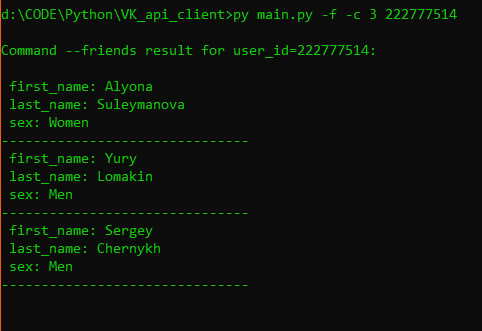
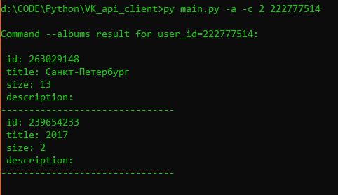
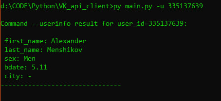

VK API Client
=============

Автор
-----

Автор: Меньшиков Александр Сергеевич  
Группа: КН-202

Описание
--------

VK API Client - это консольная утилита на Python, которая предоставляет доступ к VK API для получения информации о пользователях, их друзьях и альбомах.

Принцип работы VK API
---------------------

VK API предоставляет набор методов для взаимодействия с социальной сетью ВКонтакте. Для использования VK API необходимо иметь токен доступа, который выдается при регистрации приложения на платформе VK.

Утилита VK API Client использует HTTP-запросы к VK API для выполнения различных операций. Например, для получения списка друзей пользователя, она отправляет GET-запрос на метод `friends.get` с указанием идентификатора пользователя и других параметров.

Настройки
---------

Для работы утилиты необходимо настроить файл `settings.json`, который содержит следующую информацию:


```json
{   
  "vk_api_url": "https://api.vk.com/method/",   
  "access_token": "your_token",   
  "vk_api_version": "5.131"
}
```

*   `vk_api_url` - URL-адрес VK API.
*   `access_token` - ваш токен доступа VK API.
*   `vk_api_version` - версия VK API.

Использование
-------------

Для получения справки по использованию утилиты можно вызвать следующую команду:

```shell
py main.py -h
```

Утилита поддерживает следующие параметры командной строки:


```shell
usage: main.py [-h] [-f] [-a] [-u] [-c COUNT] user_id

positional arguments: 
  user_id               Идентификатор пользователя VK. 
   
optional arguments:   
  -h, --help            Показать справку и выйти.  
  -f, --friends         Вывести список друзей пользователя по его идентификатору. 
  -a, --albums          Вывести список альбомов пользователя по его идентификатору. 
  -u, --userinfo        Вывести информацию о пользователе по его идентификатору.   
  -c COUNT, --count COUNT                         
                        Максимальное количество записей.
```

Пример использования
--------------------

### Вывод списка друзей


```shell
py main.py -f -c 3 user_id
```



### Вывод списка альбомов


```shell
py main.py -a -c 2 user_id
```



### Вывод информации о пользователе


```shell
py main.py -u user_id
```


